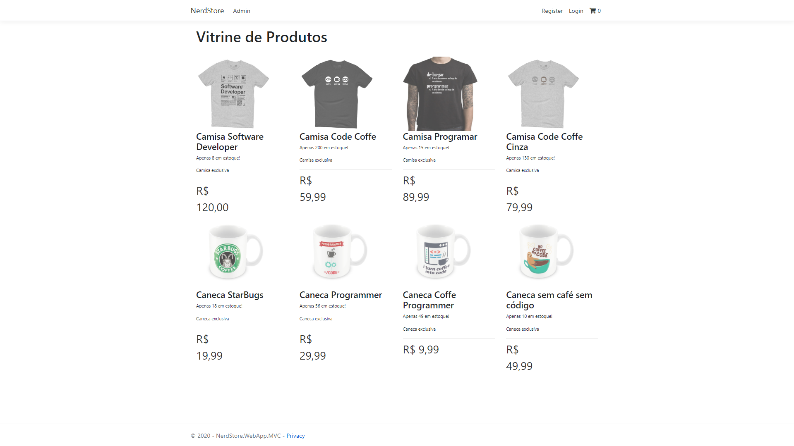
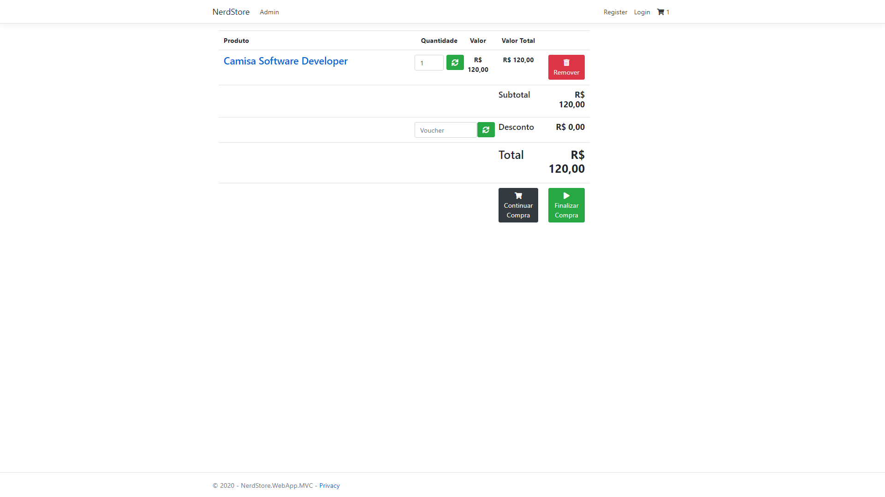
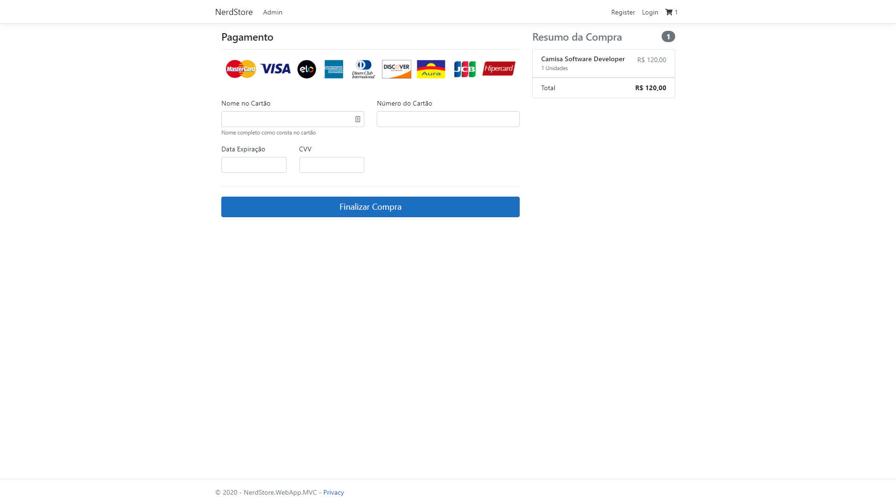
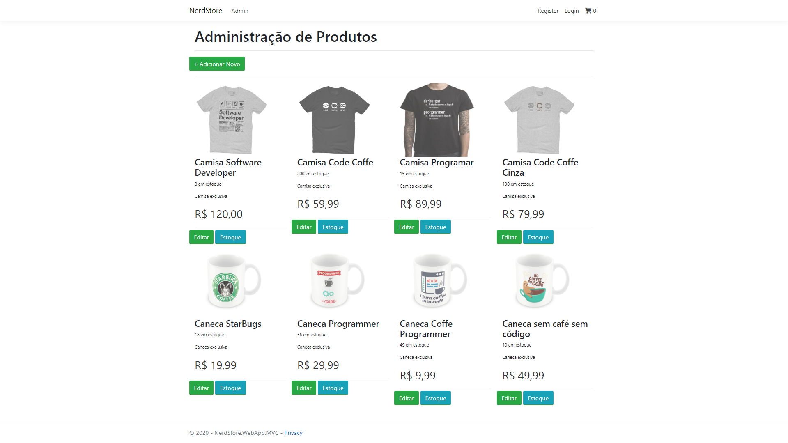
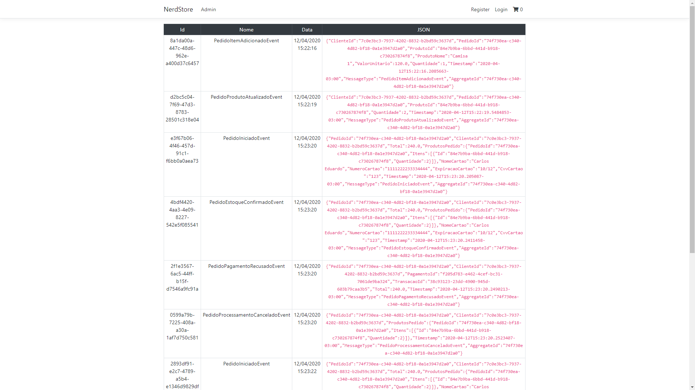

<h1 align="center">
    NerdStore
</h1>
 

	 

  <a href="#beginner-sobre">Sobre</a>&nbsp;&nbsp;&nbsp;|&nbsp;&nbsp;&nbsp;
  <a href="#fire-como-contribuir">Como contribuir</a>&nbsp;&nbsp;&nbsp;|&nbsp;&nbsp;&nbsp;
  <a href="#lock-licença">Licença</a>

Projeto desenvolvido com finalidade de estudos sobre DDD (Domain-Drovem Design) e Event Sourcing.

> “Nós podemos buscar o estado de uma aplicação para encontrar o estado atual do mundo, e isso responde muitas perguntas. Entretanto há momentos que nós não só queremos ver onde nós estamos, mas também queremos saber como chegamos lá.”

##  :beginner: Sobre
**NerdStore** é a implementação de uma loja virtual utilizando os conceitos de DDD e Event Sourcing utilizando .NET Core 3.1. A estrutura do projeto está dividida em contextos, são eles: catalogo, vendas, pagamentos e core.

 - **Catalogo**: Esse contexto é o responsável por gerenciar todo os estoque dos produtos com regras de validação e garantir que não aconteça nenhum inconsistência no banco de dados.
 - **Vendas**: Esse contexto é o responsável por gerenciar os pedidos dos clientes.
 - **Pagamentos**: Esse contexto é o responsável por realizar a integração com uma api de pagamentos e finalizar ou recusar o pedido do cliente.
 - **Core**: Esse contexto é o responsável por realizar a comunicação entre todos os contextos da aplicação através de eventos de integração.

Projeto desenvolvido durante o curso de domínio ricos ministrado por [Eduardo Pires](https://desenvolvedor.io).

## :camera: Imagens

Vitrine dos produtos disponíveis na loja

Carrinho do cliente

Pagamento do pedido através de cartão de crédito

Gerenciamento de produtos

Histórico do pedido coletado através de Event Sourcing.

 ##  :fire: Como contribuir
 
Contribuições são sempre bem-vindas e podem ser feitas de várias formas.
 1. **Reportar um bug**  
Se você encontrar algum bug, ele poderá ser reportar através de issues [aqui]().

 2. **Solicitar uma nova funcionalidade**  
 Você pode solicitar uma nova funcionalidade através de issues [aqui]() e  caso queria, poderá implementa-lá seguindo os passos:
-   Faça um fork desse repositório;
-   Cria uma branch com a sua feature:  `git checkout -b minha-feature`;
-   Faça commit das suas alterações:  `git commit -m 'feat: Minha nova feature'`;
-   Faça push para a sua branch:  `git push origin minha-feature`.

##  :lock: Licença

Esse projeto está sob a licença MIT.
